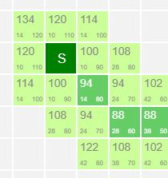
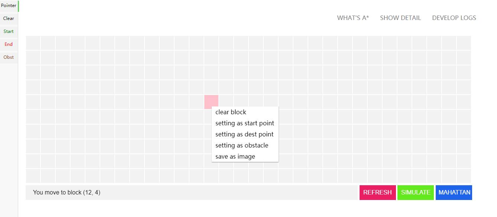
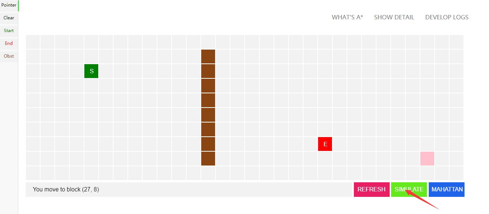
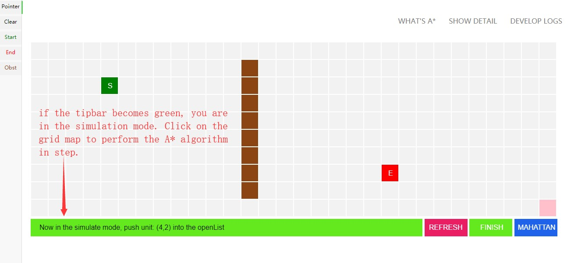
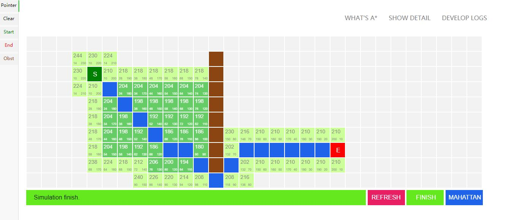
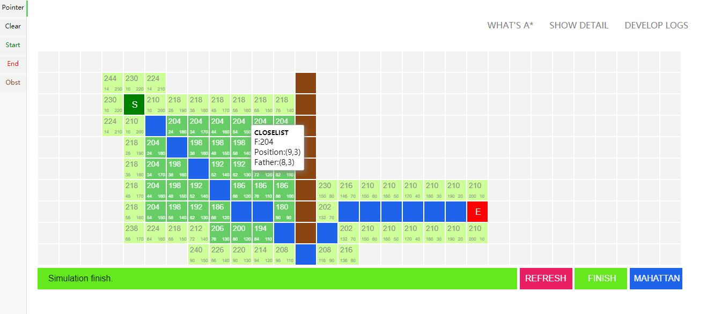
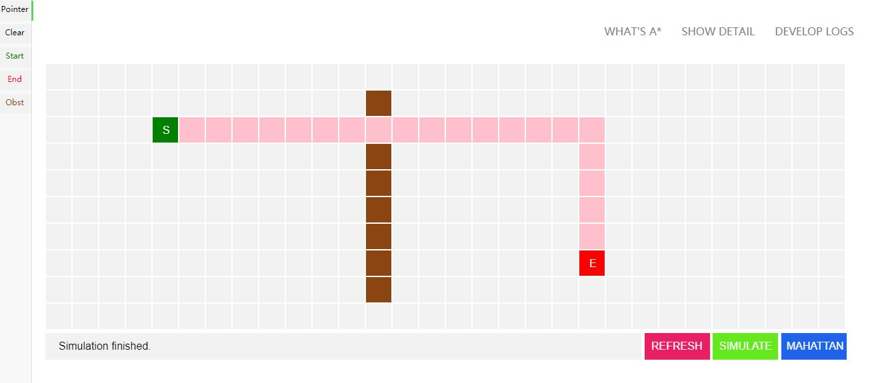

# A star algorithm simulator

Implemented in javascript, this project helps you better understand how A* algorithm works for it **draws** how A* algorithm works step by step.

## Some definition

Here I have defined 3 kinds of block: 

- `start block` in green, means the start point.
- `destination block` in red, means the destination point.
- `obstacle block` in brown, means  the obstacle that you can not pass.

What's more, I have defined 2 kinds of mode:

- `edit mode`: in this mode you can edit the position of start block, end block and obstacle. By default, you are in edit mode. If you are in the simulation mode, click the green `FINISH` button to get back to edit mode.
- `simulation mode`: in this mode what you can only do is - click on the grid map to perform the simulation.  If you are in the edit mode, click the green `SIMULATION` button to get into the simulation mode **(MAKE SURE YOU HAVE SET THE START POINT AND THE DEST POINT)**. 

About the button:

- `REFRESH`: clean all the block in the grid map to help you go back to the initial state.
- `SIMULATE` or `FINISH`: if you are in the edit mode, click the green button (which says `SIMULATE`) to enter the simulation mode. Otherwise, click the green button (which says `FINISH`) to go back to the edit mode.
- `MANHATTAN`: it is useless but if  you want to see the Manhattan distance that our A* algorithm uses (when calculating the Manhattan distance it will ignore the obstacle blocks). This button is invalided in simulation mode.

About the information on the block:

- `S`: start block

- `E`: destination block

- `NODES IN THE OPENLIST AND CLOSELIST`: if you are in the simulation mode, you will see this two kinds of block that in yellow green color and light green color (as below). There have three number in these node, from top to bottom, from left to right they means: total distance, distance to start point, estimated distance to destination (Manhattan distance here) point.

  

## How to make it work

1. Open the index.html in browser.

2. Right click your mouse or click the left toolbar to set the block (I have defined 3 kinds of block: start block, destination block and obstacle block)

   

3. All right, if you have finished setting the block **(make sure you have set the start block and destination block, that is necessary!)**, click the green block to enter the `simulation mode`.

   

   

4. Click on the grid map to start step simulation, if you have reached the destination, the shortest path will be colored in blue.

   

5. Tips: you can hover on the green node to see detail information stored in the blocks.

   

6. Click the `FINISH` button to go back to the edit mode. You can click the blue button to show the Manhattan distance in the block.

   

Enjoy it !
